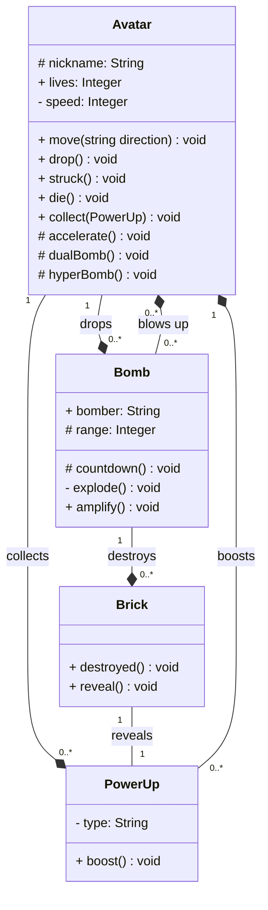

# 

# Table of Contents

- [**Overview**](#overview)
- [**Tech Stack**](#tech-stack)
  - [Languages](#languages)
  - [Development](#development)
  - [OS & Version Control](#os-version-control)
- [**Installation**](#installation)
  - [Cloning](#cloning)
  - [File System](#file-system)
  - [Running](#running)
- [**Usage**](#usage)
  - [GEDOM](#gedom)
    - [Virtual Node](#virtual-node)
    - [Router](#router)
    - [State](#state)
- [**Gameplay**](#gameplay)
- [**Blueprints**](#blueprints)
  - [Models](#models)
- [**Aknowledgements**](#aknowledgements)
  - [Contributors](#contributors)
  - [Peers](#peers)
  - [Testers](#testers)
  - [Auditors](#auditors)
- [**Sources**](#sources)
- [**License**](#license)

## Overview


###### [_Table of Contents ⤴️_](#table-of-contents)

## Tech Stack

### Languages

Click on badges to get to the code...

[]()
[]()
[]()
[]()

### Development

[](./gitify.sh)
[](#table-of-contents)

### OS & Version Control

[](https://github.com)

###### [_Table of Contents ⤴️_](#table-of-contents)

## Installation

### Cloning

```bash
$ git clone http://learn.zone01dakar.sn/git/jefaye/bomberman-dom
$ cd bomberman-dom/
```

### File System

    .
    ├── public
    │   ├── assets
    │   │   ├── avatar
    │   │   │   ├── actor.png
    │   │   │   ├── ennemi.png
    │   │   │   └── money.png
    │   │   ├── bomb
    │   │   │   └── bomb.png
    │   │   ├── map
    │   │   │   ├── bloc.png
    │   │   │   └── mur.png
    │   │   ├── soundEffect
    │   │   │   ├── sound_bomb.mp3
    │   │   │   └── title-screen.mp3
    │   │   ├── bumberman.png
    │   │   ├── images-removebg-preview.png
    │   │   └── mainbg.jpeg
    │   ├── src
    │   │   ├── components
    │   │   │   ├── avatar.js
    │   │   │   ├── bomb.js
    │   │   │   ├── grid.js
    │   │   │   └── powerUp.js
    │   │   ├── core
    │   │   │   ├── node.js
    │   │   │   ├── router.js
    │   │   │   └── state.js
    │   │   ├── interface
    │   │   │   ├── barreScore.js
    │   │   │   ├── menuPause.js
    │   │   │   └── sound.js
    │   │   ├── utils
    │   │   │   └── viewport.js
    │   │   └── app.js
    │   ├── index.css
    │   └── index.html
    ├── audit.todo
    ├── gitify.sh
    ├── go.mod
    ├── LICENSE
    ├── main.go
    └── README.md

    11 directories, 31 files

### Running

###### [_Table of Contents ⤴️_](#table-of-contents)

## Usage

### GEDOM

_GEDOM_ is a framework-like tool that is meant to be used in any web application to simplify **DOM Manipulation**. It uses the concept of **DOM Abstraction** to create web components without having to use all those DOM methods. As an example, _GEDOM_ will be use to create a basic [**TodoMVC**](https://todomvc.com/) web application.

#### [Virtual Node](./client/src/core/node.js)

The Virtual Node is a class that generates a component, given a 'properties' object as arguments.  
Basically, the properties object would be in this configuration:

```js
  const properties = {
    tag: /* HTML tag name (default: 'div') */ ,
    attrs: {
      // attribute: value
      // ...
    },
    listeners: {
      // event: callback function
      // ...
    },
    children: [
      // VirtualNode || Object || String
      // ...
    ]
  }
```

Calling the **render()** method on an instance of a Virtual Node will **create the element** through the tag field value, then **set attributes and listeners**, then **add all given children** of one of these types:

**virtual node**

```js
const TodoApp = new VirtualNode({
  tag: "section",
  attrs: {
    class: "todoapp",
  },
  children: [todoHeader, todoMain, todoFooter],
});
```

**object**

```js
class TodoHeader extends VirtualNode {
  constructor() {
    super({
      tag: "header",
      attrs: {
        class: "header",
      },
      children: [
        {
          tag: "h1",
          children: ["todos"],
        },
        {
          tag: "input",
          attrs: {
            class: "new-todo",
            placeholder: "What needs to be done?",
            autofocus: "",
          },
          listeners: {
            onchange: (event) => {
              if (event.target.value.trim() !== "") {
                todoList.addTodo(event.target.value);
                event.target.value = "";
              }
            },
          },
        },
      ],
    });
  }
}
```

**string**

```js
export default new VirtualNode({
  tag: "footer",
  attrs: {
    class: "info",
  },
  children: [
    {
      tag: "p",
      children: ["Double-click to edit  a todo"],
    },
    {
      tag: "p",
      children: ["Created by the Todo01   team"],
    },
    {
      tag: "p",
      children: ["Part of ", new Link("https://todomvc.com/", "TodoMVC")],
    },
  ],
});
```

Finally, the VirtualNode class will **returns** the created element that can now be append to any element of the **DOM**.

#### [State](./client/src/core/state.js)

The State of the application is set using an object that can contain any sort of data. The power of the state manager resides in the facts that it is the **ONE** source of truth for the entire application.  
First, an instance of the **State** class is initialized with all data of the application that can be changed by the components logic.

```js
const todoState = new State({
  todos: [],
  filter: "all",
  counter: {
    active: 0,
    completed: 0,
  },
});
```

The **subscribe()** method will basically add any **funtion**, **method** or **callback** that needs to update one or more elements of the application.

```js
todoState.subscribe(todoMain.toggleDisplay.bind(todoMain));
todoState.subscribe(todoFooter.toggleDisplay.bind(todoFooter));
todoState.subscribe(todoList.display.bind(todoList));
todoState.subscribe(clearCompleted.toggleDisplay.bind(clearCompleted));
todoState.subscribe(todoCount.refresh.bind(todoCount));
```

Instead of changing the element directly, the modifications will be done in the State using the **set()** method.  
The method contains a private method (**#notify()**) that will call all the subscribed functions, which will update all elements without needing to refresh the entire page/template.

```js
todoState.set({
  todos: todoState.current.todos.filter((todo) => !todo.state.completed),
  counter: {
    ...todoState.current.counter,
    completed: 0,
  },
});
```

Optionally, the **set()** method can take a callback as an argument for more complex operations.

#### [Router](./client/src/core/router.js)

The Router as the name implies is supposed to in conjunction with the **State** manager in order to determine which components will be rendered given the current URI of the address.  
Once the router instance is created, the routes are registered using the **add()** method that takes the endpoint of the URL and the handler that basically apply the rendering of the allowed components.

```js
const router = new Router();
router.add("/", () => {
  todoState.set({ filter: "all" });
});

router.add("/active", () => {
  todoState.set({ filter: "active" });
});

router.add("/completed", () => {
  todoState.set({ filter: "completed" });
});
```

Whenever the address changes, the router get the resulting URL and change the state of the application so it can take care of the rest.  
The URL is supposed to be a hash link so it won't redirect to a different page while avoiding page reload.

###### [_Table of Contents ⤴️_](#table-of-contents)

## Gameplay

###### [_Table of Contents ⤴️_](#table-of-contents)

## Blueprints

### Models



## Aknowledgements

### Contributors

[](http://learn.zone01dakar.sn/git/fakeita)
[](http://learn.zone01dakar.sn/git/aliouniang)
[](http://learn.zone01dakar.sn/git/mamadbah)
[](http://learn.zone01dakar.sn/git/jefaye)

### Peers

[](http://learn.zone01dakar.sn/git/lodiouf)

### Testers

[](http://learn.zone01dakar.sn/git/mandaw)

### Auditors

[](http://learn.zone01dakar.sn/git/)
[](http://learn.zone01dakar.sn/git/)
[](http://learn.zone01dakar.sn/git/)
[](http://learn.zone01dakar.sn/git/)
[](http://learn.zone01dakar.sn/git/)

###### [_Table of Contents ⤴️_](#table-of-contents)

## Sources

###### [_Table of Contents ⤴️_](#table-of-contents)

## License

[](./LICENSE)